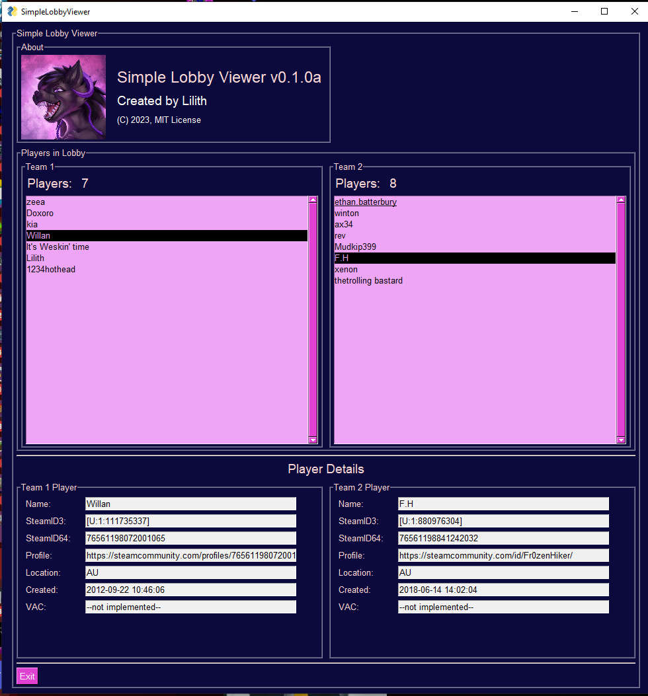

# lilith_tf2e
A *CURRENLTY BROKEN WIP* TF2Explorer w/ GUI program written in Python, inspired by the Bash09 TF2 Bot Kicker 

# Current in progress
Currently working on the `gui/lobbyviewer.py` simple GUI class, and it is fairly functional given a complete `data/` directory. 

Example:


**NOTE:**  

You will need to make a `data/` directory to house a `config.yml` and a `.env` file. They can be structured as such:

`config.yml`:
```
tf2:
  dir: "path/to/tf2"
  rcon:
    password: "lilith_is_hot"
```

and

`.env`:
```
STEAM_WEB_API_KEY="YOUR_STEAM_API_KEY_HERE"
```

I also used two photos in the `data/` dir that get loaded by the `gui/lobbyviewer.py`. These were `lilith.png` and `tf2.png`. I have **NOT** included these in the repo because I do not own the TF2 logo (although it would probably be fine if I used it), and because Lilith is my OC and the artwork is commissioned and not MIT licensed.

These images were `2000x2000` and in PNG format. Feel free to replace them with whatever you like.

# Main dependencies
- PySimpleGUI
- steam_converter
- rcon
- steam
- psutil
- schedule
- loguru
- PyYAML

My intention is for this application to be fairly heavy weight, but nicely concurrent with a mix of python multiprocessing and threading.

I had to add the following lines to my `autoexec.cfg` to allow the `gui/lobbyviewer.py` to interface with TF2:
```
ip 0.0.0.0
rcon_password lilith_is_hot
net_start 
```
Note that you don't actually need to specify the rcon_password as such, but rather it can be whatever you want, as long as `data/config.yml` corresponds to this.

# The purpose
The point of this project is to eventually create and end-to-end, front-to-back, GUI, python and SQLite powered application to interface with Team Fortress 2.
This will be achieved via RCON and monitoring the console.log file, and will take advantage of the Steam Web API, and several other external APIs (such as Bash09's cheater list, and 
megascatterbomb's mcd or anti-cheat (when its released)).

If you want an actually complete and functional program, see Bash's TF2 Bot Kicker GUI (written in Rust! blazingly fast!) --> https://github.com/Bash-09/tf2-bot-kicker-gui
